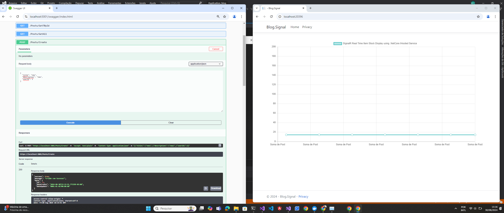

### 🛠 Tecnologias

As seguintes ferramentas foram usadas na construção do projeto:

- [C#](https://expo.io/)
- [net5.0](https://dotnet.microsoft.com/pt-br/download/dotnet/5.0)
- [EfCore InMemory](https://learn.microsoft.com/en-us/ef/core/providers/in-memory/?tabs=dotnet-core-cli)
- [CQRS](https://learn.microsoft.com/pt-br/azure/architecture/patterns/cqrs)
- [API WEB](https://learn.microsoft.com/pt-br/aspnet/core/tutorials/first-web-api?view=aspnetcore-8.0&tabs=visual-studio)

Projeto desafio DATUM

ITEM CRIAR USER

ITEM LISTAR USERS

ITEM CRIAR POST

ITEM lISTAR USERS FOR POSTS

Posts e painel de quantidade de posts em Tempo Real

